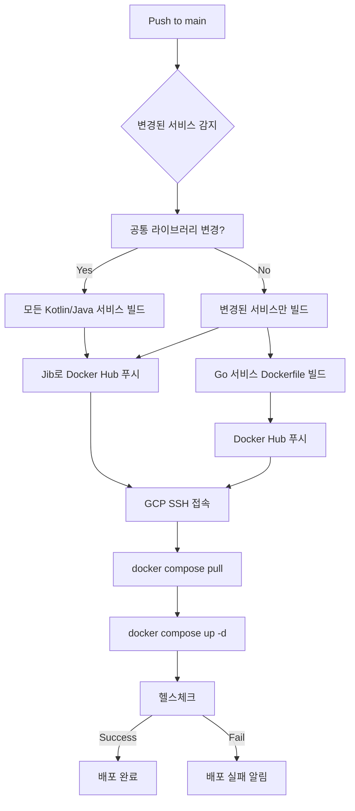

# CI/CD 파이프라인 설정 가이드

## 개요
GitHub Actions를 활용하여 GCP 운영 서버에 자동 배포하는 CI/CD 파이프라인입니다.

## 아키텍처

```
┌─────────────────┐      ┌──────────────────┐      ┌──────────────────┐
│  Developer      │      │  GitHub Actions  │      │  GCP Server      │
│  (Local)        │─────▶│  (CI/CD)         │─────▶│  (Production)    │
└─────────────────┘      └──────────────────┘      └──────────────────┘
      │                          │                          │
      │ develop → release/v0.x.0 │ 2. Build & Push         │ 3. Pull & Deploy
      │ 1. PR & Merge            │    (Docker Hub)         │    (무중단)
      │                          │    Tags: latest, v0.x.0 │
      └──────────────────────────┴─────────────────────────┘
```

## Git Flow & Versioning

**브랜치 전략**:
- `develop` - 개발 통합 브랜치
- `release/v0.x.0` - 릴리즈 브랜치 (CI/CD 트리거)
- `main` - 프로덕션 안정 버전

**버전 관리**:
- Semantic Versioning 0.x.y (정식 출시 전)
- 마이너 버전 증가: 기능 추가 (0.1.0 → 0.2.0)
- 패치 버전 증가: 버그 수정 (0.2.0 → 0.2.1)

📘 상세 워크플로우: [GIT_WORKFLOW.md](./GIT_WORKFLOW.md)

## 워크플로우 동작 방식

### 1단계: 변경 감지 및 버전 추출 (detect-changes)
- `release/**` 브랜치에 Push 이벤트 발생 시 트리거 (예: `release/v0.1.0`)
- Git diff로 변경된 서비스 자동 감지
- 브랜치 이름에서 버전 추출 (`release/v0.1.0` → `v0.1.0`)
- 공통 라이브러리(`onmeet-common`, `common-security`) 변경 시 모든 Kotlin/Java 서비스 리빌드
- 각 서비스별 변경 여부 및 버전 정보를 Job Output으로 전달

### 2단계: 빌드 및 푸시 (build-and-push)
**Kotlin/Java 서비스 (Jib 사용):**
- JDK 17 환경 설정
- Gradle 캐시 활용으로 빌드 속도 향상
- 변경된 서비스만 선택적으로 빌드 (`--parallel` 옵션)
- Jib로 Docker 이미지 빌드 및 Docker Hub에 직접 푸시
- **이미지 태그**: `latest` + 버전 태그 (예: `v0.1.0`)
- Docker daemon 불필요 (빠른 빌드)

**Go 서비스 (file-service):**
- Docker Buildx 사용
- Multi-platform 빌드 (linux/amd64, linux/arm64)
- **이미지 태그**: `latest` + 버전 태그 (예: `v0.1.0`)
- GitHub Actions 캐시 활용 (`type=gha`)

### 3단계: 배포 (deploy)
- SSH로 GCP 인스턴스 접속
- Docker Hub에서 최신 이미지 pull
- `docker compose up -d`로 무중단 배포
- 헬스체크로 배포 성공 확인

## 빠른 시작 가이드

### Step 1: GitHub Secrets 설정
[GITHUB_SECRETS_SETUP.md](./GITHUB_SECRETS_SETUP.md) 문서 참고하여 다음 Secrets 등록:

- `DOCKER_USERNAME` - Docker Hub 사용자명
- `DOCKER_PASSWORD` - Docker Hub Access Token
- `GCP_HOST` - GCP 인스턴스 IP
- `GCP_USERNAME` - SSH 사용자명
- `GCP_SSH_KEY` - SSH Private Key
- `GCP_SSH_PORT` - SSH 포트 (기본 22)
- `GCP_PROJECT_PATH` - 프로젝트 배포 경로

### Step 2: GCP 서버 초기 설정
[GITHUB_SECRETS_SETUP.md](./GITHUB_SECRETS_SETUP.md)의 "GCP 운영 서버 초기 설정" 섹션 참고:

1. Docker 및 Docker Compose 설치
2. 프로젝트 디렉토리 생성 및 파일 복사
3. `.env` 파일 설정 (`.env.production.template` 참고)
4. Docker 네트워크 생성
5. 인프라 서비스 시작 (Kafka, MySQL, Redis 등)
6. Docker Hub 로그인

### Step 3: 첫 릴리즈 배포
```bash
# develop 브랜치에서 릴리즈 브랜치 생성
git checkout develop
git pull origin develop
git checkout -b release/v0.1.0

# 버전 정보 커밋 (선택)
git commit --allow-empty -m "chore: prepare release v0.1.0"
git push origin release/v0.1.0

# GitHub Actions 자동 실행 확인
# https://github.com/your-org/onmeet-backend/actions

# 배포 성공 후 main에 병합
git checkout main
git merge --no-ff release/v0.1.0
git tag -a v0.1.0 -m "Release v0.1.0"
git push origin main --tags

# develop에 역병합
git checkout develop
git merge --no-ff release/v0.1.0
git push origin develop
```

## 파일 구조

```
onmeet-backend/
├── .github/
│   └── workflows/
│       └── deploy.yml              # GitHub Actions 워크플로우
├── .env.production.template        # 운영 서버 환경변수 템플릿
├── GITHUB_SECRETS_SETUP.md         # Secrets 설정 및 서버 초기 설정 가이드
├── CI_CD_SETUP_GUIDE.md            # 이 문서
├── build.gradle                    # Jib 설정 (Docker Hub 이미지 이름)
├── docker-compose.yml              # 로컬/운영 Docker Compose
└── *-service/
    ├── docker-compose.yml          # 서비스별 Docker Compose (환경변수 지원)
    ├── Dockerfile                  # Docker 이미지 빌드 파일
    └── build.gradle                # Gradle 빌드 설정
```

## 주요 최적화 포인트

### 1. 선택적 빌드 (Incremental Build)
- Git diff로 변경된 서비스만 감지
- 불필요한 빌드 시간 절약 (전체 빌드 대비 최대 87% 단축)

### 2. 병렬 빌드
- Gradle `--parallel` 옵션 사용
- 여러 서비스 동시 빌드로 시간 단축

### 3. 캐싱 전략
- **Gradle 캐시**: 의존성 다운로드 시간 절약
- **Docker Buildx 캐시**: Go 서비스 빌드 시간 단축
- **GitHub Actions 캐시**: 빌드 아티팩트 재사용

### 4. Jib 활용
- Docker daemon 불필요
- 레이어 캐싱으로 변경된 부분만 재빌드
- Docker Hub 직접 푸시로 단계 축소

### 5. 무중단 배포
- `docker compose up -d`로 롤링 업데이트
- 헬스체크로 안정성 확인

## 환경변수 관리

### 로컬 개발 환경
- `.env` 파일 사용 (Git에 커밋하지 않음)
- `DOCKER_REGISTRY` 미설정 시 기본값 `onmeet` 사용
- 이미지: `onmeet/auth-service:latest`

### 운영 환경 (GCP 서버)
- `.env` 파일에 `DOCKER_REGISTRY` 설정 필수
- `.env.production.template`을 복사하여 사용
- 이미지: `your-dockerhub-username/auth-service:latest`

### GitHub Actions
- `DOCKER_REGISTRY_PREFIX` 환경변수로 Gradle에 전달
- 빌드 시 Docker Hub 사용자명 자동 적용

## 배포 플로우 상세



## 모니터링 및 로그 확인

### GitHub Actions 로그
```bash
# GitHub 웹 UI에서 확인
# Repository → Actions → 워크플로우 선택 → 각 Job 클릭
```

### GCP 서버 로그
```bash
# SSH로 GCP 서버 접속 후
cd ~/onmeet-backend

# 전체 서비스 상태 확인
docker compose ps

# 특정 서비스 로그 확인
docker compose logs -f auth-service

# 최근 100줄 로그 확인
docker compose logs --tail=100 auth-service

# 모든 서비스 로그
docker compose logs -f
```

## 롤백 방법

### 방법 1: 이전 커밋으로 Revert
```bash
git revert HEAD
git push origin main
# GitHub Actions가 자동으로 이전 버전 배포
```

### 방법 2: 수동 롤백 (GCP 서버)
```bash
# GCP 서버에서 실행
cd ~/onmeet-backend

# 이전 이미지 태그로 변경
docker compose pull auth-service:previous-version
docker compose up -d auth-service

# 또는 전체 서비스 재시작
docker compose restart
```

### 방법 3: 특정 버전 배포
```bash
# GitHub에서 특정 태그 체크아웃
git checkout v1.2.3
git push origin main --force  # 주의: force push 사용
```

## 보안 Best Practices

1. **Secret 관리**
   - GitHub Secrets에 민감 정보 저장
   - `.env` 파일을 Git에 커밋하지 않음 (`.gitignore` 추가)

2. **SSH Key 관리**
   - 배포 전용 SSH Key 생성 (읽기 전용 권한)
   - Key Rotation 주기적으로 실행

3. **Docker Hub Token**
   - 실제 패스워드 대신 Access Token 사용
   - Write 권한만 부여 (Delete 권한 제거)

4. **GCP 방화벽**
   - 필요한 포트만 개방 (8080, 22)
   - GitHub Actions IP 대역만 허용 (선택사항)

5. **환경 분리**
   - Production/Staging 환경별 별도 Secret 사용
   - 환경별 브랜치 전략 (`main`, `staging`, `develop`)

## FAQ

### Q1: 빌드가 너무 오래 걸려요
**A:** Gradle 캐시가 활성화되어 있는지 확인하세요. 첫 빌드는 느리지만 이후부터는 빠릅니다.

### Q2: Docker Hub 로그인 실패
**A:** `DOCKER_PASSWORD`에 실제 패스워드가 아닌 Access Token을 사용했는지 확인하세요.

### Q3: SSH 연결 실패
**A:**
- SSH Key가 올바른지 확인
- GCP 방화벽에서 22번 포트가 열려있는지 확인
- `GCP_SSH_KEY`에 전체 Private Key (BEGIN/END 포함)가 복사되었는지 확인

### Q4: 특정 서비스만 배포하고 싶어요
**A:** 해당 서비스 디렉토리만 변경하여 커밋하면 자동으로 감지됩니다.

### Q5: 로컬에서 테스트하고 싶어요
**A:**
```bash
# 로컬에서 Jib 빌드 테스트
./gradlew :auth-service:jibDockerBuild

# Docker Compose로 로컬 실행
docker compose up -d
```

### Q6: 환경변수가 제대로 적용되지 않아요
**A:**
- GCP 서버의 `.env` 파일에 `DOCKER_REGISTRY` 설정 확인
- docker compose 재시작: `docker compose down && docker compose up -d`

## 트러블슈팅 체크리스트

배포 실패 시 다음을 순서대로 확인:

- [ ] GitHub Secrets 7개 모두 등록되었는가?
- [ ] GCP 서버에 Docker가 설치되어 있는가?
- [ ] GCP 서버에 `.env` 파일이 올바르게 설정되었는가?
- [ ] GCP 서버의 `DOCKER_REGISTRY` 값이 GitHub Secrets의 `DOCKER_USERNAME`과 동일한가?
- [ ] Docker Hub에 이미지가 정상적으로 푸시되었는가?
- [ ] GCP 방화벽에서 SSH 포트(22)가 열려 있는가?
- [ ] SSH Private Key가 올바르게 복사되었는가?
- [ ] GCP 서버에 Docker 네트워크(`onmeet-network`)가 생성되었는가?

## 유지보수

### 정기 작업
- **매월**: SSH Key 및 Docker Hub Token 갱신
- **분기별**: GCP 서버 디스크 용량 확인 및 정리
- **반기별**: Docker 이미지 정리 (`docker system prune -a`)

### 업데이트 권장사항
- GitHub Actions 워크플로우 버전 업데이트
- Docker Base 이미지 업데이트 (보안 패치)
- 의존성 버전 업데이트 (Gradle, Go modules)

## 참고 자료

- [GitHub Actions 공식 문서](https://docs.github.com/en/actions)
- [Docker Compose 공식 문서](https://docs.docker.com/compose/)
- [Jib 공식 문서](https://github.com/GoogleContainerTools/jib)
- [appleboy/ssh-action](https://github.com/appleboy/ssh-action)

---

**마지막 업데이트**: 2026-02-28
**담당자**: DevOps Team
**문의**: devops@onmeet.com
