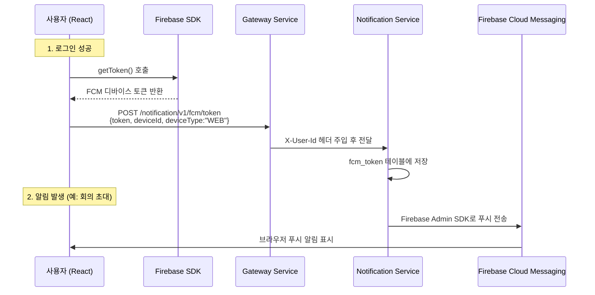

# 🔔 FCM 푸시 알림 연동 가이드 (React + Spring Boot)

## 전체 플로우



---

## ✅ 백엔드 현황 (이미 완료)

| 항목 | 상태 | 파일 |
|---|---|---|
| Firebase Admin SDK 의존성 | ✅ | `build.gradle` (`firebase-admin:9.3.0`) |
| 서비스 계정 키 | ✅ | `serviceAccountKey.json` |
| FCM 토큰 등록/해제 API | ✅ | `FcmTokenController` (`POST/DELETE /notification/v1/fcm/token`) |
| FCM 토큰 엔티티 | ✅ | `FcmToken` (userId, token, deviceId, deviceType) |
| 푸시 발송 로직 | ✅ | `FcmService.sendPush()` |
| SSE 실시간 구독 | ✅ | `SseController` (`GET /notification/v1/sse/subscribe`) |

> **백엔드는 더 이상 할 것이 없습니다.** 아래는 프론트엔드(React) 구현 가이드입니다.

---

## 🖥️ React (Frontend) 구현 가이드

### Step 1. Firebase 프로젝트 설정값 확인

Firebase Console → 프로젝트 설정 → 일반 → **웹 앱 설정**에서 아래 값을 복사:

```javascript
// .env 파일
REACT_APP_FIREBASE_API_KEY=your-api-key
REACT_APP_FIREBASE_AUTH_DOMAIN=your-project.firebaseapp.com
REACT_APP_FIREBASE_PROJECT_ID=your-project-id
REACT_APP_FIREBASE_MESSAGING_SENDER_ID=your-sender-id
REACT_APP_FIREBASE_APP_ID=your-app-id
```

### Step 2. Firebase SDK 설치

```bash
npm install firebase
```

### Step 3. Firebase 초기화 (`src/firebase.js`)

```javascript
import { initializeApp } from 'firebase/app';
import { getMessaging, getToken, onMessage } from 'firebase/messaging';

const firebaseConfig = {
  apiKey: process.env.REACT_APP_FIREBASE_API_KEY,
  authDomain: process.env.REACT_APP_FIREBASE_AUTH_DOMAIN,
  projectId: process.env.REACT_APP_FIREBASE_PROJECT_ID,
  messagingSenderId: process.env.REACT_APP_FIREBASE_MESSAGING_SENDER_ID,
  appId: process.env.REACT_APP_FIREBASE_APP_ID,
};

const app = initializeApp(firebaseConfig);
const messaging = getMessaging(app);

export { messaging, getToken, onMessage };
```

### Step 4. Service Worker 등록 (`public/firebase-messaging-sw.js`)

> ⚠️ 이 파일은 반드시 `public/` 폴더 루트에 위치해야 합니다.

```javascript
importScripts('https://www.gstatic.com/firebasejs/10.8.0/firebase-app-compat.js');
importScripts('https://www.gstatic.com/firebasejs/10.8.0/firebase-messaging-compat.js');

firebase.initializeApp({
  apiKey: 'your-api-key',
  authDomain: 'your-project.firebaseapp.com',
  projectId: 'your-project-id',
  messagingSenderId: 'your-sender-id',
  appId: 'your-app-id',
});

const messaging = firebase.messaging();

// 백그라운드 메시지 수신 (탭이 비활성일 때)
messaging.onBackgroundMessage((payload) => {
  const { title, body } = payload.notification;
  self.registration.showNotification(title, {
    body,
    icon: '/logo192.png',
    data: payload.data,
  });
});
```

### Step 5. 로그인 후 FCM 토큰 등록 (핵심!)

```javascript
import { messaging, getToken } from './firebase';

// Firebase Console → 프로젝트 설정 → Cloud Messaging → VAPID 키
const VAPID_KEY = 'your-vapid-key';

/**
 * 로그인 성공 후 호출
 * @param {string} jwtToken - 로그인 시 받은 JWT 토큰
 */
async function registerFcmToken(jwtToken) {
  try {
    // 1. 브라우저 알림 권한 요청
    const permission = await Notification.requestPermission();
    if (permission !== 'granted') {
      console.warn('알림 권한이 거부되었습니다.');
      return;
    }

    // 2. FCM 디바이스 토큰 발급
    const fcmToken = await getToken(messaging, { vapidKey: VAPID_KEY });

    // 3. 디바이스 고유 ID 생성 (브라우저별 고유값)
    let deviceId = localStorage.getItem('deviceId');
    if (!deviceId) {
      deviceId = crypto.randomUUID();
      localStorage.setItem('deviceId', deviceId);
    }

    // 4. 백엔드에 FCM 토큰 등록
    await fetch('/api/notification/v1/fcm/token', {
      method: 'POST',
      headers: {
        'Content-Type': 'application/json',
        'Authorization': `Bearer ${jwtToken}`,
      },
      body: JSON.stringify({
        token: fcmToken,
        deviceId: deviceId,
        deviceType: 'WEB',
      }),
    });

    console.log('FCM 토큰 등록 완료');
  } catch (error) {
    console.error('FCM 토큰 등록 실패:', error);
  }
}
```

### Step 6. 포그라운드 알림 수신 (탭 활성 상태)

```javascript
import { messaging, onMessage } from './firebase';

// 앱 최상위에서 한 번만 호출
onMessage(messaging, (payload) => {
  console.log('포그라운드 알림 수신:', payload);

  // 앱 내 토스트/알림 UI 표시
  const { title, body } = payload.notification;
  // 예: toast.info(`${title}: ${body}`);
});
```

### Step 7. 로그아웃 시 토큰 해제

```javascript
async function unregisterFcmToken(jwtToken) {
  const fcmToken = await getToken(messaging, { vapidKey: VAPID_KEY });

  await fetch(`/api/notification/v1/fcm/token?token=${fcmToken}`, {
    method: 'DELETE',
    headers: { 'Authorization': `Bearer ${jwtToken}` },
  });
}
```

---

## 📋 프론트엔드 담당자 체크리스트

| # | 작업 | 필요한 값 |
|---|---|---|
| 1 | `firebase` npm 패키지 설치 | — |
| 2 | `src/firebase.js` 초기화 파일 생성 | Firebase 웹 앱 설정값 |
| 3 | `public/firebase-messaging-sw.js` 생성 | Firebase 웹 앱 설정값 |
| 4 | 로그인 성공 콜백에서 `registerFcmToken()` 호출 | VAPID 키 |
| 5 | 앱 최상위에서 `onMessage()` 리스너 등록 | — |
| 6 | 로그아웃 시 `unregisterFcmToken()` 호출 | — |

> [!IMPORTANT]
> **VAPID 키 확인 방법:** Firebase Console → 프로젝트 설정 → Cloud Messaging → 웹 푸시 인증서 → 키 쌍 (없으면 "Generate key pair" 클릭)
