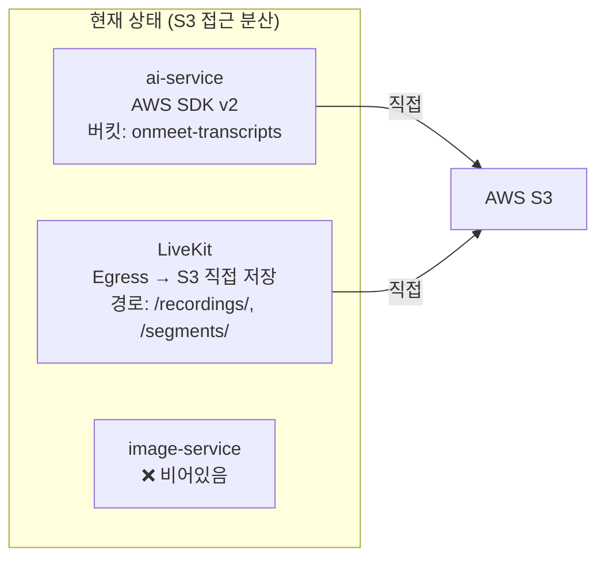

# AI Service 통합 변경 분석서

> **분석일**: 2026-03-07  
> **범위**: ai-service ↔ video-service, notification-service, image-service 간 통합

---

## Part 1. 구조적 변경 사항

아키텍처 수준에서 서비스 간 역할·통신 방식·인프라가 다른 항목들입니다.

---

### 1-1. 채팅 서비스 구조

| 항목 | ai-service 기대 | 실제 구현 |
|---|---|---|
| 서비스 주체 | 별도 `chat-service`가 Kafka로 발행 | `chat-service` **비어있음** — video-service에 통합 |
| 통신 방식 | Kafka 토픽 `chat.events` 소비 | STOMP WebSocket + LiveKit DataChannel |
| 발행 구현 | `ChatEventsConsumer` ← Kafka | `ChatIntegrationService` → `NoOpMeetingEventPublisher` (로그만) |

> [!IMPORTANT]
> **변경 필요**: video-service의 `ChatIntegrationService.sendMessage()`와 `handleDataReceived()`에서 Kafka 토픽 `chat.events`로도 이벤트를 발행하도록 추가해야 합니다.

---

### 1-2. 오디오 처리 구조 ✅ 구현 완료 (video-service)

| 항목 | ai-service 기대 | 실제 구현 (PR #34 병합 후) |
|---|---|---|
| 오디오 소스 | 참가자별 개별 청크 (`userId`+`trackId`) | ✅ **참가자별 Track Egress** (`participantIdentity`+`trackSid`) |
| 업로드 주체 | video-service가 S3 업로드 후 Kafka 알림 | **LiveKit**이 S3 직접 저장 → Webhook `egress_ended` → `RoomRecordingService` |
| S3 경로 | `audio-chunks/{roomId}/{userId}/...` | `/recordings/{roomId}/{participantIdentity}/audio_{trackSid}.ogg` |
| 트리거 | Kafka `audio.chunk.ready` → `SttWorkerService` | Webhook → DB 저장까지 완료. ⚠️ **Kafka 발행은 미구현** |
| 늦게 입장한 참가자 | — | ✅ `startParticipantTrackEgress()` 자동 시작 |

> [!IMPORTANT]
> **남은 작업**: `RoomRecordingService.handleEgressEnded()` 완료 후 `publishAudioSegmentReady()` → Kafka `audio.chunk.ready` 발행 로직 필요 (video-service 담당자 영역)

---

### 1-3. 회의 종료 이벤트 구조

| 항목 | ai-service 기대 | 실제 구현 |
|---|---|---|
| 이벤트 흐름 | Kafka `meeting.ended` → `TranscriptBuilderService.finalizeMeeting()` | `MeetingRoomService.end()` → `NoOpMeetingEventPublisher` (로그만) |
| 구현 상태 | Consumer 준비됨 | ❌ Kafka 발행 미구현 + TODO 주석 |

> [!IMPORTANT]
> **변경 필요**: `MeetingRoomService.end()` 메서드에서 `NoOpMeetingEventPublisher` 대신 Kafka로 `meeting.ended` 이벤트를 발행하는 `KafkaMeetingEventPublisher` 구현체가 필요합니다.

---

### 1-4. 알림 서비스 통신 구조

| 항목 | ai-service 기대 | 실제 구현 |
|---|---|---|
| 통신 | Kafka `minutes.generated` → notification-service 소비 | notification-service는 **REST API 기반** (`/notification/internal/send`) |
| Kafka 사용 | notification-service가 Kafka Consumer | ❌ `build.gradle`에 `spring-kafka` 의존성 없음 |
| 현재 패턴 | - | video-service → `RestTemplate` → notification-service |

> [!NOTE]
> **변경 방향**: ai-service에서 `minutes.generated` 이벤트 발행 후, 별도 어댑터(또는 ai-service 내부 리스너)가 notification-service의 REST API를 호출하는 방식이 현실적입니다. notification-service에 Kafka를 추가하는 것보다 기존 패턴(REST)을 따르는 것이 일관적입니다.

---

### 1-5. 파일 서비스(image-service) 구조

| 항목 | ai-service 현재 | image-service | video-service |
|---|---|---|---|
| 구현 상태 | AWS SDK v2로 S3 **직접 접근** | ❌ **빈 프로젝트** (Java 파일 없음, settings.gradle 미포함) | LiveKit Egress가 S3에 직접 저장 |
| S3 버킷 | `onmeet-transcripts` (전용 버킷) | 없음 | S3 경로만 설정 (LiveKit이 관리) |
| S3 클라이언트 | `S3StorageClient` (자체 구현) | 없음 | 없음 (LiveKit이 S3 접근) |

#### 파일 서비스 역할 정리가 필요한 이유

현재 프로젝트에서 **S3/파일 접근이 분산**되어 있습니다:



#### 고려해야 할 파일 서비스 설계 방향

| 방향 | 설명 | ai-service 변경 |
|---|---|---|
| **A. 각 서비스가 S3 직접 접근 (현행 유지)** | ai-service, LiveKit 각각 S3에 직접 접근. image-service 불필요 | LocalStack → AWS S3로 설정만 변경 |
| **B. image-service를 중앙 파일 서비스로 구현** | 모든 파일 업/다운로드를 image-service REST API 경유 | `S3StorageClient` → `FileServiceClient`(REST) 교체 |
| **C. 하이브리드** | 대용량 파일(오디오)은 S3 직접 접근, 메타만 파일 서비스로 관리 | 인터페이스(`StorageClient`) 유지, 구현체 교체 |

> [!WARNING]
> **LocalStack → 실제 S3 전환 시 변경 필요** (방향 A 기준):
> - `AwsS3Config.java`의 endpoint/credentials 분기 처리는 이미 구현됨
> - `application.yml`의 `aws.s3.endpoint`를 비우면 실제 AWS S3 사용
> - AWS IAM 자격 증명 설정 필요 (환경변수 또는 EC2 Instance Profile)
> - video-service 녹화 파일과 **동일 S3 버킷을 공유할지**, 별도 버킷을 쓸지 결정 필요

---

### 1-6. Kafka 인프라 현황

| 서비스 | spring-kafka | docker-compose Kafka | Redis | S3/LocalStack |
|---|---|---|---|---|
| ai-service | ✅ | ✅ | ✅ | ✅ |
| video-service | ❌ | ❌ | ❌ | ❌ (LiveKit 경유) |
| notification-service | ❌ | ❌ | ❌ | ❌ |

> [!IMPORTANT]
> **인프라 통합**: video-service에 Kafka 의존성(`spring-kafka`)을 추가하고, docker-compose에 Kafka 서비스를 연결하거나 ai-service의 Kafka를 동일 네트워크로 공유해야 합니다.

---

### 1-7. MeetingEventPublisher 구현 교체

현재 video-service의 `MeetingEventPublisher` 인터페이스에 8개 메서드가 정의되어 있으나, **NoOp 구현체**만 존재합니다:

| 메서드 | Kafka 토픽 매핑 필요 여부 |
|---|---|
| `publishMeetingStarted()` | 📌 선택 (ai-service 불필요, notification에 유용) |
| `publishMeetingEnded()` | ✅ **필수** — `meeting.ended` |
| `publishParticipantJoined()` | 📌 선택 |
| `publishParticipantLeft()` | 📌 선택 |
| `publishAudioSegmentReady()` | ✅ **필수** — `audio.chunk.ready` |
| `publishChatMessage()` | ✅ **필수** — `chat.events` |
| `publishScreenShareStarted()` | 📌 선택 |
| `publishScreenShareStopped()` | 📌 선택 |

---

## Part 2. 데이터 타입 & 포맷 불일치

동일한 개념을 나타내지만 타입이나 형식이 다른 항목들입니다. 구조 확정 후 맞춰야 할 사항입니다.

---

### 2-1. ID 체계 ✅ 정합성 맞춤 완료

| 개념 | ai-service (변경 후) | video-service | 상태 |
|---|---|---|---|
| 회의 식별자 | `roomId` (`Long`) | `roomId` (`Long`) | ✅ 일치 |
| 참가자 식별자 | `participantIdentity` (`String`) | `participantIdentity` (`String`) | ✅ 일치 (사용자 지정 이름) |
| 발신자 ID | `senderId` (`Long`) | `senderId` (`Long`) | ✅ 일치 |
| 채팅 메시지 ID | `messageId` (`String`, UUID) | `messageId` (`String`, UUID) | ✅ 일치 |

---

### 2-2. 시간 필드 ✅ Instant로 통일 완료

| ai-service 필드 (변경 후) | 타입 | video-service 대응 | 타입 | 상태 |
|---|---|---|---|---|
| `timestamp` | `Instant` | `timestamp` | `Instant` | ✅ 일치 |
| `endedAt` | `Instant` | `endedAt` | `Instant` | ✅ 일치 |
| `startTime` / `endTime` | `Instant` | `startTime` / `endTime` | `String` | ⚠️ video에 `Instant` 변경 요청 필요 |
| `segmentStartMs` / `segmentEndMs` | `long` (offset ms) | — | — | ai 내부 전용 (VAD 발화 구간) |

---

### 2-3. 이벤트별 필드 매핑 상세 (최신)

#### `AudioChunkReadyEvent` (ai-service) ← `AudioSegmentEvent` (video-service)

| ai-service 필드 | 타입 | video-service 필드 | 타입 | 상태 |
|---|---|---|---|---|
| `roomId` | `Long` | `roomId` | `Long` | ✅ 일치 |
| `participantIdentity` | `String` | `participantIdentity` | `String` | ✅ 일치 |
| `segmentIndex` | `int` | `segmentIndex` | `int` | ✅ 일치 |
| `s3Path` | `String` | `s3Path` | `String` | ✅ 일치 |
| `startTime` | `Instant` | `startTime` | `String` | ⚠️ video에 `Instant` 변경 요청 |
| `endTime` | `Instant` | `endTime` | `String` | ⚠️ video에 `Instant` 변경 요청 |
| `timestamp` | `Instant` | — | — | ai에서 `Instant.now()` 세팅 |
| ~~`userId`~~ | ~~`Long`~~ | — | — | ✅ 삭제됨 → `participantIdentity`로 통합 |
| ~~`trackId`~~ | ~~`String`~~ | — | — | ✅ 삭제됨 (참가자당 트랙 1개로 불필요) |
| ~~`format`~~ | ~~`String`~~ | — | — | ✅ 삭제됨 (OGG 고정) |
| ~~`chunkStartMs`/`chunkEndMs`~~ | ~~`long`~~ | — | — | ✅ 삭제됨 → `startTime`/`endTime`으로 대체 |

#### `VoiceSegmentCreatedEvent` (ai-service 내부)

| 필드 | 타입 | 설명 |
|---|---|---|
| `roomId` | `Long` | 회의 ID |
| `segmentId` | `String` | UUID 발화 구간 ID |
| `participantIdentity` | `String` | 참가자 이름 (사용자 지정) |
| `segmentStartMs` | `long` | 발화 구간 시작 (epoch ms) |
| `segmentEndMs` | `long` | 발화 구간 종료 (epoch ms) |
| `seq` | `long` | 정렬 기준값 |
| `text` | `String` | STT 결과 텍스트 |
| `timestamp` | `Instant` | 이벤트 발생 시간 |

#### `ChatMessageEvent` / `MeetingEndedEvent` — 변경 없음 (기존과 동일)

---

### 2-4. S3 키 패턴

| 용도 | ai-service 패턴 | video-service 패턴 (Track Egress 적용 후) |
|---|---|---|
| **참가자별 오디오** | `s3Path` 그대로 사용 | `/recordings/{roomId}/{participantIdentity}/audio_{trackSid}.ogg` |
| 전체 믹스 (보관용) | — | `/recordings/{roomId}/full_audio.ogg` |
| 트랜스크립트 | `transcripts/{roomId}/transcript.json` | — (ai 전용) |
| 요약 | `minutes/{roomId}/summary.json` | — (ai 전용) |

---

## Part 3. 결정 필요 항목 (Decision Points)

아래 항목들은 코드 변경 전에 **팀 차원에서 결정**이 필요합니다.

| # | 결정 사항 | 선택지 |
|---|---|---|
| **D1** | 회의 ID 체계 | ✅ **확정**: ai-service가 `roomId`(`Long`) 직접 사용 |
| **D2** | 오디오 처리 방식 | ✅ **확정**: 참가자별 Track Egress + ai-service VAD 후처리 |
| **D3** | 파일 서비스 역할 | A) 각 서비스 S3 직접 접근 / B) 중앙 파일 서비스 구현 / C) 하이브리드 |
| **D4** | 알림 전달 방식 | A) notification-service에 Kafka Consumer 추가 / B) ai-service에서 REST로 직접 호출 |
| **D5** | 채팅 `atMs` 계산 | ✅ **확정**: `atMs` 삭제, `timestamp`(`Instant`)로 통일 |
| **D6** | S3 버킷 전략 | A) 서비스별 버킷 분리 / B) 하나의 버킷에 prefix로 구분 |
| **D7** | 공통 모듈 적용 | ✅ **완료** — `build.gradle` 의존성 추가, `FilterRegistrationBean` 추가, 예외 표준화 |
| **D8** | 시간 필드 체계 | ✅ **확정**: `epochMs`(long) → `java.time.Instant`로 통일 |

---

## Part 4. 추가 확인 사항

구조·데이터 외에 통합 시 반드시 챙겨야 할 항목들입니다.

---

### 4-1. ~~공통 모듈 미적용~~ ✅ 완료

> 해결됨: `build.gradle`에 `common-security`, `onmeet-common` 의존성 추가 완료.
> `GatewayPreAuthFilter`, `BaseGlobalExceptionHandler`, `ErrorResponse`, `EntityNotFoundException` 모두 적용.

---

### 4-2. ~~API 경로 불일치~~ ✅ 완료

> 해결됨: `MinutesController`의 `@RequestMapping`을 `/api/minutes` → `/v1/minutes`로 변경.
> `context-path: /ai` + `/v1/minutes` = `/ai/v1/minutes/**` → 게이트웨이 `/ai/v1/**`과 일치.

---

### 4-3. 게이트웨이의 파일 서비스 라우팅

게이트웨이 `application.yml`과 `GATEWAY_ROUTES.md`에 파일 서비스 라우팅이 이미 정의되어 있습니다:

| 라우팅 | Path | Target | 포트 |
|---|---|---|---|
| `file-service` | `/file/v1/**` | `http://file-service:8086` | 8086 |
| `file-service-public` | `/file/swagger/**`, `/file/actuator/**` | `http://file-service:8086` | 8086 |
| (`GATEWAY_ROUTES.md`에만) | `/image/**` | `http://image-service:8086` | 8086 |

> [!NOTE]
> `file-service`와 `image-service`가 **동일 포트 8086**으로 매핑되어 있어, 같은 서비스의 다른 이름으로 보입니다. 현재 `image-service` 디렉토리는 비어있으므로, `file-service`로 통합 구현하는 것이 계획된 것으로 보입니다.

---

### 4-4. 게이트웨이에 chat-service 라우팅 잔존

| Path | Target | 상태 |
|---|---|---|
| `/chat/v1/**` | `http://chat-service:8084` | ❌ 서비스 비어있음 |

채팅이 video-service에 통합되었으므로, 게이트웨이에서 이 라우팅을 **제거하거나 video-service로 리다이렉트**해야 합니다.

---

### 4-5. ~~에러 처리 패턴 차이~~ ✅ 완료

> 해결됨: `GlobalExceptionHandler extends BaseGlobalExceptionHandler` 적용.
> `MinutesService`의 not found → `EntityNotFoundException`(404), empty transcript → `IllegalArgumentException`(400)으로 표준화.

---

### 4-6. ~~Observability(모니터링) 차이~~ ✅ 완료

> 해결됨: `build.gradle`에 Prometheus, Brave Tracing, Zipkin Reporter 의존성 추가 완료.
> `application.yml`에 `management.endpoints`, `zipkin.tracing`, `tracing.sampling` 설정 추가 완료.
> video-service와 동일한 Observability 스택 적용.

---

## Part 5. 오디오 처리 전략 — 확정

> 상세 분석: [audio_strategy_analysis.md](file:///C:/Users/Lenovo/.gemini/antigravity/brain/d41d889a-a352-45cc-bd17-fccd367de339/audio_strategy_analysis.md)

### 확정: 참가자별 Track Egress (10분 청크) + ai-service VAD

```
video-service:
  ① 전체 믹스 (FULL_AUDIO) — 현행 유지 (보관용)
  ② 참가자별 Track Egress (10분) — 추가 구현
     → 10분마다 Webhook → Kafka audio.chunk.ready

ai-service:
  ③ 수신 → VAD 무음 스킵 ($0) → STT ($0.003/분) → 화자 100%
```

| 항목 | 값 |
|---|---|
| 비용 | $0.23/회의 (5명, 1시간) |
| 화자 | 100% |
| 실시간성 | 10분마다 |
| 병렬 처리 | ✅ |
| ai-service 변경 | 최소 (VAD 추가만) |
| video-service 변경 | Track Egress 생명주기 관리 |

---

## Part 6. 구조적 변경 종합 — 액션 리스트

### ✅ 완료

| # | 작업 | 상태 |
|---|---|---|
| A1 | `build.gradle`에 `onmeet-common`, `common-security` 의존성 추가 | ✅ |
| A2 | `SecurityConfig`에 `FilterRegistrationBean` 중복 방지 추가 | ✅ |
| A3 | `MinutesController` API 경로 `/api/minutes` → `/v1/minutes` | ✅ |
| A4 | `MinutesService` 예외 표준화 (`EntityNotFoundException`) | ✅ |

### 🔴 결정 후 작업 필요

| # | 작업 | 결정 사항 | 담당 서비스 |
|---|---|---|---|
| B1 | 오디오 처리 방식 확정 | ✅ 확정: 참가자별+10분 청크+VAD | video + ai |
| B2 | `KafkaMeetingEventPublisher` 구현 | D2 확정 후 | video-service |
| B3 | `NoOpMeetingEventPublisher` → Kafka 교체 | B2 이후 | video-service |
| B4 | video-service에 `spring-kafka` 의존성 추가 | B2 이후 | video-service |
| B5 | Kafka 토픽 이벤트 DTO 필드 통일 | D1: ID 체계 확정 (roomId/meetingId) | 양쪽 |
| B6 | 파일 서비스 역할 확정 | D3: S3 직접 vs 중앙 파일 서비스 | file-service |
| B7 | `StorageClient` → `FileServiceStorageClient` 교체 | B6 이후 | ai-service |
| B8 | S3 버킷 전략 확정 | D6: 서비스별 분리 vs 공용 | 인프라 |
| B9 | 알림 연동 방식 확정 | D4: Kafka vs REST | ai + notification |
| B10 | `chat.events` Kafka 발행 추가 | 채팅 통합 후 | video-service |

### 🟡 선택적 개선

| # | 작업 | 우선순위 |
|---|---|---|
| C1 | ~~ai-service Observability 추가 (Prometheus, Tracing, Zipkin)~~ | ✅ 완료 |
| C2 | 게이트웨이에서 `chat-service` 라우팅 제거 | 정리 |
| C3 | video-service 에러 패턴 통일 (`BizException` → `CommonExceptions`) | 장기 |
