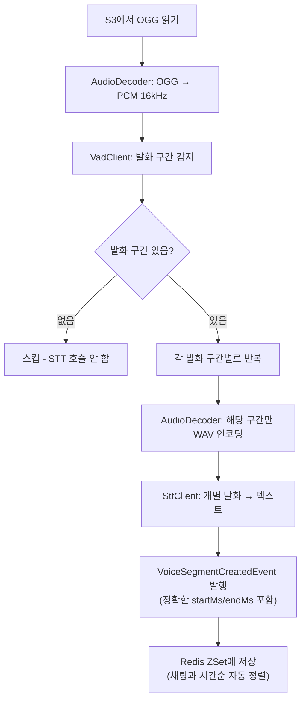

# ai-service VAD(Voice Activity Detection) 기능 추가

> **목적**: 참가자별 오디오 청크(10분)를 수신한 후, **발화 구간만 추출**하여 STT API 호출 비용을 절감하고 정확도를 높임

---

## 배경

현재 `SttWorkerService.handleAudioChunk()` 파이프라인:

```
S3에서 오디오 읽기 → 전체 byte[] → STT API 호출 → 텍스트 결과
```

**문제**: 참가자별 10분 청크에는 실제 발화 20~30%, 나머지 70~80%는 무음. 무음까지 STT에 넘기면 **비용 낭비** + 빈 결과 반환.

**변경 후**:
```
S3에서 오디오 읽기 → VAD로 발화 구간 감지 → 발화 구간만 추출 → STT API 호출
```

---

## 기술 스택

| 항목 | 선택 | 이유 |
|---|---|---|
| **VAD 모델** | [Silero VAD v4](https://github.com/snakers4/silero-vad) (ONNX) | 경량(~2MB), 고정확도, 무료, Java 공식 예제 존재 |
| **추론 엔진** | [ONNX Runtime Java](https://onnxruntime.ai/) | Maven Central 배포, Java 17 호환, CPU 추론 ~1ms/30ms chunk |
| **오디오 디코딩** | `javax.sound.sampled` + FFmpeg(선택) | OGG→PCM 16kHz mono 변환 필요 |

### Maven/Gradle 의존성 추가

```groovy
// ONNX Runtime for Silero VAD
implementation 'com.microsoft.onnxruntime:onnxruntime:1.17.1'

// OGG Vorbis 디코딩 (javax.sound에서 OGG 미지원이므로 필요)
implementation 'org.gagravarr:vorbis-java-core:0.8'
```

### 모델 파일

`silero_vad.onnx` (~2MB)를 `src/main/resources/models/silero_vad.onnx`에 배치.

---

## 구현 구조

### 파일 계층

```
ai-service/src/main/java/com/onmeet/ai/pipeline/
├── stt/
│   ├── SttClient.java              (기존 인터페이스)
│   ├── OpenAiSttClient.java        (기존 구현)
│   └── FakeSttClient.java          (기존 Fake)
├── vad/
│   ├── VadClient.java              [NEW] 인터페이스
│   ├── SileroVadClient.java        [NEW] Silero VAD ONNX 구현
│   └── NoOpVadClient.java          [NEW] VAD 비활성화 시 전체 오디오 반환
├── audio/
│   └── AudioDecoder.java           [NEW] OGG → PCM 16kHz mono 변환
└── ...

ai-service/src/main/resources/
└── models/
    └── silero_vad.onnx             [NEW] Silero VAD 모델 파일
```

### 핵심 인터페이스

```java
// VadClient.java
public interface VadClient {
    /**
     * 오디오 바이트에서 발화 구간만 추출하여 반환.
     * @param pcmAudio 16kHz, mono, 16-bit PCM 오디오
     * @return 발화 구간만 이어붙인 PCM 바이트 (발화 없으면 빈 배열)
     */
    List<SpeechSegment> detectSpeech(float[] pcmSamples, int sampleRate);

    record SpeechSegment(int startSample, int endSample) {}
}
```

### 파이프라인 흐름 (변경 후)



> [!IMPORTANT]
> **발화별 개별 STT** 호출 방식을 적용하여, 각 음성 구간이 정확한 타임스탬프를 갖고 Redis ZSet에 저장됩니다.
> 이를 통해 채팅 메시지와 음성 전사가 실제 발생 시간 기준으로 정확하게 교차됩니다.
```

---

## SttWorkerService 변경 포인트

**현재 코드 (간략)**:
```java
public void handleAudioChunk(AudioChunkReadyEvent e) {
    byte[] audio = storageClient.readBytes(e.getAudioFileKey());
    String text = sttClient.transcribe(audio, filename, mimeType).trim();
    if (text.isBlank()) return;
    // ... publish event
}
```

**변경 후 (발화별 개별 STT 호출)**:
```java
public void handleAudioChunk(AudioChunkReadyEvent e) {
    byte[] oggBytes = storageClient.readBytes(e.getAudioFileKey());
    
    // 1. OGG → PCM 16kHz mono
    float[] pcmSamples = audioDecoder.decode(oggBytes);
    
    // 2. VAD로 발화 구간 감지 (여러 개 반환 가능)
    List<SpeechSegment> segments = vadClient.detectSpeech(pcmSamples, 16000);
    if (segments.isEmpty()) return;  // 무음 청크 → 스킵
    
    // 3. 각 발화 구간별로 개별 STT 호출
    for (int i = 0; i < segments.size(); i++) {
        SpeechSegment seg = segments.get(i);
        
        // 해당 발화 구간만 WAV로 인코딩
        byte[] segmentAudio = audioDecoder.extractAndEncode(pcmSamples, seg);
        
        // 개별 STT 호출
        String text = sttClient.transcribe(segmentAudio, "seg-" + i + ".wav", "audio/wav").trim();
        if (text.isBlank()) continue;
        
        // 발화 구간의 실제 시간 계산 (청크 시작 + 구간 오프셋)
        long segStartMs = e.getChunkStartMs() + seg.startMs();
        long segEndMs   = e.getChunkStartMs() + seg.endMs();
        long seq = ((long) e.getChunkSeq()) * 1_000_000L + i;
        
        producer.publish(VoiceSegmentCreatedEvent.builder()
                .roomId(e.getRoomId())
                .segmentId(UUID.randomUUID().toString())
                .userId(e.getUserId())
                .startMs(segStartMs)     // 정확한 발화 시작 시간
                .endMs(segEndMs)         // 정확한 발화 종료 시간
                .seq(seq)
                .text(text)
                .timestamp(Instant.now())
                .build());
    }
}
```

> [!NOTE]
> **핵심**: 하나의 10분 청크에서 3개의 발화가 감지되면, 3개의 개별 `VoiceSegmentCreatedEvent`가 발행됨.
> 각 이벤트의 `startMs`/`endMs`가 정확하므로, Redis ZSet에서 채팅 메시지와 오차 없이 시간순으로 교차됨.

---

## 설정 (application.yml)

```yaml
app:
  vad:
    enabled: true                    # false면 NoOpVadClient 사용 (VAD 스킵)
    model-path: classpath:models/silero_vad.onnx
    threshold: 0.5                   # 발화 감지 임계값 (0.0~1.0)
    min-speech-duration-ms: 250      # 최소 발화 길이 (잡음 방지)
    min-silence-duration-ms: 300     # 무음 구간 감지 최소 시간
    speech-pad-ms: 30                # 발화 시작/끝 패딩
```

---

## CC 위임용 프롬프트

> **[To Claude Code]**
> - **Role:** Senior Java/Spring Developer
> - **Goal:** ai-service에 Silero VAD(Voice Activity Detection) 기능을 추가하여, 오디오 청크에서 발화 구간만 추출한 뒤 STT로 전달하는 파이프라인 구현
> - **Tech Spec:**
>   - **의존성 추가** (`build.gradle`):
>     - `com.microsoft.onnxruntime:onnxruntime:1.17.1`
>     - `org.gagravarr:vorbis-java-core:0.8`
>   - **모델 파일**: Silero VAD ONNX 모델을 `src/main/resources/models/silero_vad.onnx`에 배치 (GitHub에서 다운로드: https://github.com/snakers4/silero-vad/raw/master/src/silero_vad/data/silero_vad.onnx)
>   - **새 파일 3개**:
>     1. `pipeline/vad/VadClient.java` — 인터페이스 (`detectSpeech(float[], int) → List<SpeechSegment>`)
>     2. `pipeline/vad/SileroVadClient.java` — ONNX Runtime으로 Silero VAD 실행, `@ConditionalOnProperty(name="app.vad.enabled", havingValue="true")` 적용
>     3. `pipeline/vad/NoOpVadClient.java` — VAD 비활성화 시 전체를 하나의 SpeechSegment로 반환
>     4. `pipeline/audio/AudioDecoder.java` — OGG → PCM 16kHz mono float[] 변환 + 발화 구간 추출 후 WAV 인코딩
>   - **기존 파일 수정**:
>     - `SttWorkerService.java`: `VadClient`와 `AudioDecoder`를 주입받아 handleAudioChunk() 흐름에 VAD 단계 삽입
>   - **설정** (`application.yml`): `app.vad.enabled`, `app.vad.model-path`, `app.vad.threshold` 등 추가
>   - **테스트**: `SttWorkerServiceTest` 업데이트 — VAD Mock 주입, 발화 없을 때 STT 미호출 검증
> - **Action Items:**
>   1. `build.gradle`에 ONNX Runtime + Vorbis 의존성 추가
>   2. Silero VAD ONNX 모델 파일 다운로드 및 배치
>   3. `VadClient` 인터페이스 + `SileroVadClient` + `NoOpVadClient` 구현
>   4. `AudioDecoder` (OGG→PCM, 발화 구간 WAV 인코딩) 구현
>   5. `SttWorkerService.handleAudioChunk()` 수정 — VAD 파이프라인 삽입
>   6. `application.yml` 설정 추가
>   7. 기존 테스트 수정 및 새 단위 테스트 추가
>   8. 빌드 검증 (`compileJava`, `compileTestJava`)
> - **Deliverable:** 변경된 전체 파일 + 모델 파일 + 테스트 코드

---

## 검증 계획

### 자동 테스트
- `SttWorkerServiceTest`: VAD Mock 주입, 발화 없는 경우 STT 미호출 검증
- `SileroVadClientTest`: 알려진 오디오 파일로 발화 구간 감지 정확도 검증
- `AudioDecoderTest`: OGG→PCM 변환 정확성 검증

### 수동 검증
- 실제 회의 녹음 파일(OGG)을 사용하여 VAD→STT 파이프라인 E2E 테스트
- 무음만 있는 10분 청크에서 STT 호출이 스킵되는지 확인
