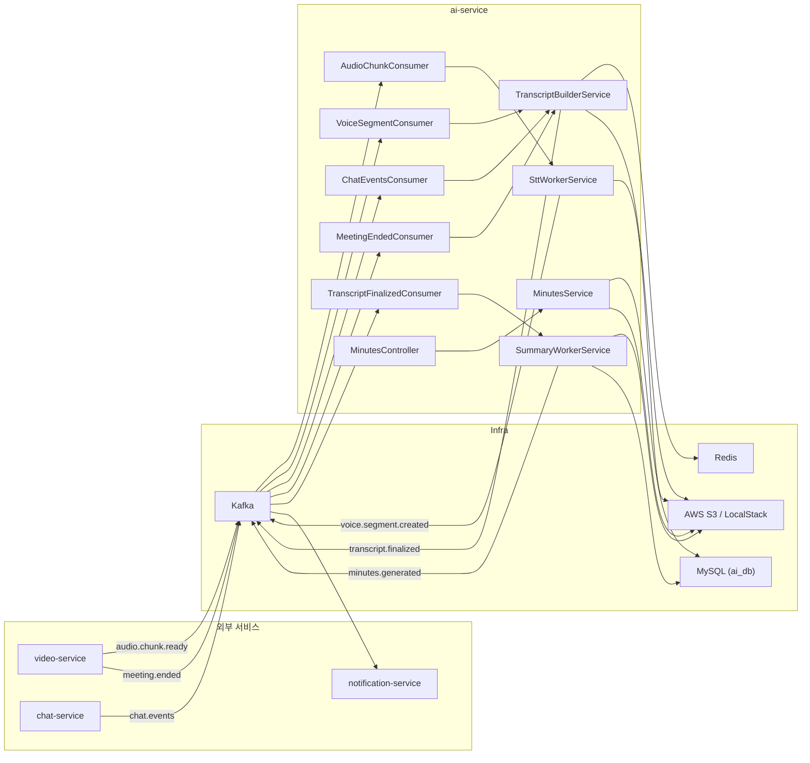

# AI Service 명세서

> **서비스 포트**: `8082`  
> **패키지**: `com.onmeet.ai`  
> **마지막 갱신**: 2026-02-22

---

## 1. 아키텍처 개요



---

## 2. Kafka 토픽 명세

### 2.1 소비(Consume) 토픽 — ai-service가 **수신**하는 데이터

| 토픽명 | 설정 키 | 발행 서비스 | Consumer 클래스 | Consumer Group | 설명 |
|---|---|---|---|---|---|
| `audio.chunk.ready` | `app.kafka.topics.audio-chunk-ready` | **video-service** | `AudioChunkConsumer` | `ai-stt-worker` | 오디오 청크가 S3에 업로드 완료됨 |
| `chat.events` | `app.kafka.topics.chat-events` | **chat-service** | `ChatEventsConsumer` | `ai-transcript-builder` | 채팅 메시지 발생 |
| `voice.segment.created` | `app.kafka.topics.voice-segment-created` | **ai-service (자체)** | `VoiceSegmentConsumer` | `ai-transcript-builder` | STT 결과(음성 세그먼트) 생성됨 |
| `meeting.ended` | `app.kafka.topics.meeting-ended` | **video-service** | `MeetingEndedConsumer` | `ai-transcript-builder` | 회의 종료 |
| `transcript.finalized` | `app.kafka.topics.transcript-finalized` | **ai-service (자체)** | `TranscriptFinalizedConsumer` | `ai-summary-worker` | 트랜스크립트 확정 |

### 2.2 발행(Produce) 토픽 — ai-service가 **송신**하는 데이터

| 토픽명 | 설정 키 | Producer 클래스 | 수신 서비스 | 설명 |
|---|---|---|---|---|
| `voice.segment.created` | `app.kafka.topics.voice-segment-created` | `VoiceSegmentProducer` | **ai-service (자체)** | STT 완료 후 음성 세그먼트 발행 |
| `transcript.finalized` | `app.kafka.topics.transcript-finalized` | `TranscriptEventsProducer` | **ai-service (자체)** | 트랜스크립트 확정 이벤트 |
| `minutes.generated` | `app.kafka.topics.minutes-generated` | `MinutesEventsProducer` | **notification-service** 등 | 회의록 생성 완료 알림 |

---

## 3. 이벤트 DTO 명세

### 3.1 `AudioChunkReadyEvent` — video-service → ai-service

| 필드 | 타입 | 설명 | 예시 |
|---|---|---|---|
| `meetingId` | `String` | 회의 ID | `"mtg-abc-123"` |
| `participantId` | `String` | 참가자(트랙 주인) ID | `"user-001"` |
| `trackId` | `String` | 트랙 ID | `"track-xyz"` |
| `chunkSeq` | `int` | 청크 순번 (0-based) | `3` |
| `chunkStartMs` | `long` | 청크 시작 시간(ms) | `45000` |
| `chunkEndMs` | `long` | 청크 종료 시간(ms) | `60000` |
| `audioFileKey` | `String` | S3 오디오 파일 키 | `"audio-chunks/mtg-abc-123/user-001/3.webm"` |
| `format` | `String` | 오디오 포맷 | `"webm"`, `"ogg"`, `"wav"` |
| `occurredAtEpochMs` | `long` | 이벤트 발생 시각 (epoch ms) | `1708612800000` |

---

### 3.2 `ChatMessageEvent` — chat-service → ai-service

| 필드 | 타입 | 설명 | 예시 |
|---|---|---|---|
| `meetingId` | `String` | 회의 ID | `"mtg-abc-123"` |
| `messageId` | `String` | 메시지 고유 ID (중복 제거용) | `"msg-uuid-001"` |
| `senderId` | `String` | 발신자 ID | `"user-002"` |
| `atMs` | `long` | 회의 기준 상대 시간(ms) | `32500` |
| `seq` | `long` | 정렬 보조키 (동일 ms 시 순서 보장) | `1` |
| `content` | `String` | 채팅 내용 | `"안녕하세요"` |
| `occurredAtEpochMs` | `long` | 이벤트 발생 시각 (epoch ms) | `1708612800000` |

---

### 3.3 `MeetingEndedEvent` — video-service → ai-service

| 필드 | 타입 | 설명 | 예시 |
|---|---|---|---|
| `meetingId` | `String` | 회의 ID | `"mtg-abc-123"` |
| `endedAtEpochMs` | `long` | 회의 종료 시각 (epoch ms) | `1708616400000` |

---

### 3.4 `VoiceSegmentCreatedEvent` — ai-service ↔ ai-service (내부)

| 필드 | 타입 | 설명 | 예시 |
|---|---|---|---|
| `meetingId` | `String` | 회의 ID | `"mtg-abc-123"` |
| `segmentId` | `String` | 세그먼트 UUID | `"seg-uuid-001"` |
| `participantId` | `String` | 화자(트랙 주인) ID | `"user-001"` |
| `trackId` | `String` | 트랙 ID (optional) | `"track-xyz"` |
| `startMs` | `long` | 음성 시작 시간(ms) | `45000` |
| `endMs` | `long` | 음성 종료 시간(ms) | `60000` |
| `seq` | `long` | 정렬 보조키 | `3000000` |
| `text` | `String` | STT 변환 텍스트 | `"오늘 회의 시작하겠습니다"` |
| `occurredAtEpochMs` | `long` | 이벤트 발생 시각 (epoch ms) | `1708612800000` |

---

### 3.5 `TranscriptFinalizedEvent` — ai-service 내부

| 필드 | 타입 | 설명 | 예시 |
|---|---|---|---|
| `meetingId` | `String` | 회의 ID | `"mtg-abc-123"` |
| `transcriptId` | `String` | 트랜스크립트 UUID | `"txn-uuid-001"` |
| `transcriptS3Key` | `String` | S3 저장 경로 | `"transcripts/mtg-abc-123/txn-uuid-001.json"` |
| `version` | `int` | 버전 | `1` |
| `finalizedAtEpochMs` | `long` | 확정 시각 (epoch ms) | `1708616500000` |

---

### 3.6 `MinutesGeneratedEvent` — ai-service → notification-service 등

| 필드 | 타입 | 설명 | 예시 |
|---|---|---|---|
| `meetingId` | `String` | 회의 ID | `"mtg-abc-123"` |
| `transcriptId` | `String` | 트랜스크립트 ID | `"txn-uuid-001"` |
| `transcriptS3Key` | `String` | 트랜스크립트 S3 키 | `"transcripts/mtg-abc-123/txn-uuid-001.json"` |
| `generatedAtEpochMs` | `long` | 생성 시각 (epoch ms) | `1708616600000` |

---

## 4. REST API 명세

**Base Path**: `/api/minutes`

| Method | Path | Request Body | Response | 설명 |
|---|---|---|---|---|
| `GET` | `/{meetingId}` | — | `MinutesResponse` | 회의록 조회 |
| `POST` | `/{meetingId}/regenerate` | `MinutesRegenerateRequest` (optional) | `MinutesResponse` | 회의록 재생성 |
| `PATCH` | `/{meetingId}` | `MinutesPatchRequest` | `MinutesResponse` | 회의록 수정 (공개범위/사용자 편집) |
| `GET` | `/{meetingId}/transcript` | — | `String` (JSON) | 원본 트랜스크립트 JSON 조회 |

### 4.1 `MinutesRegenerateRequest`

| 필드 | 타입 | 필수 | 기본값 | 설명 |
|---|---|---|---|---|
| `language` | `String` | N | `"ko"` | 요약 언어 |
| `style` | `String` | N | `"default"` | 요약 스타일 |
| `model` | `String` | N | `"claude-sonnet"` | AI 모델 |

### 4.2 `MinutesPatchRequest`

| 필드 | 타입 | 필수 | 설명 |
|---|---|---|---|
| `accessScope` | `MinutesAccessScope` | N | 공개 범위 (`PRIVATE`, `TEAM`, `PUBLIC`) |
| `userEditedSummaryJson` | `String` | N | 사용자 편집 요약 JSON |

### 4.3 `MinutesResponse`

| 필드 | 타입 | 설명 |
|---|---|---|
| `meetingId` | `String` | 회의 ID |
| `transcriptId` | `String` | 트랜스크립트 ID |
| `transcriptS3Key` | `String` | 트랜스크립트 S3 키 |
| `summaryS3Key` | `String` | 요약 S3 키 |
| `summaryJson` | `String` | AI 생성 요약 JSON |
| `userEditedSummaryJson` | `String` | 사용자 편집 요약 JSON (nullable) |
| `status` | `MinutesStatus` | 상태 |
| `accessScope` | `MinutesAccessScope` | 공개 범위 |
| `lastError` | `String` | 마지막 에러 메시지 (nullable) |
| `createdAt` | `Instant` | 생성 시각 |
| `updatedAt` | `Instant` | 수정 시각 |

---

## 5. 데이터 모델

### 5.1 `Minutes` 엔티티 (MySQL `minutes` 테이블)

| 컬럼명 | 타입 | 제약 조건 | 설명 |
|---|---|---|---|
| `meeting_id` | `VARCHAR(64)` | **PK**, NOT NULL | 회의 ID |
| `transcript_id` | `VARCHAR(64)` | NOT NULL | 트랜스크립트 ID |
| `transcript_s3_key` | `VARCHAR(512)` | NOT NULL | 트랜스크립트 S3 경로 |
| `summary_s3_key` | `VARCHAR(512)` | — | 요약 S3 경로 |
| `summary_json` | `LONGTEXT` | NOT NULL | AI 생성 요약 JSON |
| `user_edited_summary_json` | `LONGTEXT` | — | 사용자 편집 요약 JSON |
| `status` | `VARCHAR(32)` | NOT NULL | 상태 (Enum) |
| `access_scope` | `VARCHAR(16)` | NOT NULL | 공개 범위 (Enum) |
| `last_error` | `VARCHAR(1024)` | — | 마지막 에러 |
| `created_at` | `TIMESTAMP` | NOT NULL | 생성 시각 |
| `updated_at` | `TIMESTAMP` | NOT NULL | 수정 시각 |

### 5.2 Enum 정의

**`MinutesStatus`**

| 값 | 설명 |
|---|---|
| `GENERATED` | AI 생성 완료 |
| `EDITED_BY_USER` | 사용자 편집됨 |
| `REGENERATING` | 재생성 진행 중 |
| `FAILED` | 생성/재생성 실패 |

**`MinutesAccessScope`**

| 값 | 설명 |
|---|---|
| `PRIVATE` | 비공개 (기본값) |
| `TEAM` | 팀 공개 |
| `PUBLIC` | 전체 공개 |

---

## 6. S3 키 규칙

| 용도 | 패턴 | 예시 |
|---|---|---|
| 오디오 청크 | `audio-chunks/{meetingId}/{participantId}/{chunkSeq}.{ext}` | `audio-chunks/mtg-001/user-001/3.webm` |
| 트랜스크립트 | `transcripts/{meetingId}/{transcriptId}.json` | `transcripts/mtg-001/txn-uuid.json` |
| 요약 | `minutes/{meetingId}/{transcriptId}/summary.json` | `minutes/mtg-001/txn-uuid/summary.json` |

> **S3 버킷**: `onmeet-transcripts`

---

## 7. 서비스별 필요 데이터 요약

### 7.1 video-service → ai-service

> video-service가 **발행해야 하는** 데이터

| 토픽 | 이벤트 | 필수 필드 |
|---|---|---|
| `audio.chunk.ready` | `AudioChunkReadyEvent` | `meetingId`, `participantId`, `trackId`, `chunkSeq`, `chunkStartMs`, `chunkEndMs`, `audioFileKey`, `format`, `occurredAtEpochMs` |
| `meeting.ended` | `MeetingEndedEvent` | `meetingId`, `endedAtEpochMs` |

> [!IMPORTANT]
> `audioFileKey`에 해당하는 오디오 파일이 **S3에 먼저 업로드된 후** 이벤트를 발행해야 합니다.

### 7.2 chat-service → ai-service

> chat-service가 **발행해야 하는** 데이터

| 토픽 | 이벤트 | 필수 필드 |
|---|---|---|
| `chat.events` | `ChatMessageEvent` | `meetingId`, `messageId`, `senderId`, `atMs`, `seq`, `content`, `occurredAtEpochMs` |

> [!NOTE]
> `messageId`는 중복 제거(dedup)에 사용되므로 반드시 고유해야 합니다.

### 7.3 ai-service → notification-service

> ai-service가 **발행하는** 데이터

| 토픽 | 이벤트 | 필드 |
|---|---|---|
| `minutes.generated` | `MinutesGeneratedEvent` | `meetingId`, `transcriptId`, `transcriptS3Key`, `generatedAtEpochMs` |

> [!TIP]
> notification-service는 이 이벤트를 수신하여 사용자에게 회의록 생성 완료 알림을 보낼 수 있습니다.

---

## 8. 외부 연동 (External APIs)

### 8.1 OpenAI — STT (Speech-to-Text)

| 항목 | 값 |
|---|---|
| API URL | `https://api.openai.com/v1/audio/transcriptions` |
| 모델 | `gpt-4o-mini-transcribe` |
| 인증 | `Authorization: Bearer ${OPENAI_API_KEY}` |
| 요청 형식 | `multipart/form-data` (`file`, `model`, `language`) |
| 응답 | 텍스트 (transcription) |

### 8.2 Anthropic Claude — NLP (요약)

| 항목 | 값 |
|---|---|
| API URL | `https://api.anthropic.com/v1/messages` |
| 모델 | `claude-sonnet-4-20250514` |
| 인증 | `x-api-key: ${ANTHROPIC_API_KEY}` |
| API 버전 | `2023-06-01` |
| 요청 | 트랜스크립트 plain text → summary JSON |

---

## 9. 인프라 의존성

| 구성 요소 | 용도 | 설정 |
|---|---|---|
| **MySQL 9.0** | Minutes 엔티티 저장 | DB: `ai_db`, Port: `3308→3306` |
| **Kafka 3.7 (KRaft)** | 이벤트 메시징 | Port: `9092`(internal), `9094`(external) |
| **Redis 7.0** | Meeting Event Store (중간 버퍼) | Port: `6379`, TTL: `24h` |
| **AWS S3 / LocalStack** | 오디오, 트랜스크립트, 요약 저장 | Region: `ap-northeast-2`, Bucket: `onmeet-transcripts` |

---

## 10. 파이프라인 흐름 요약

```
1. [video-service] 오디오 청크를 S3에 업로드 → audio.chunk.ready 이벤트 발행
2. [ai-service] AudioChunkConsumer → SttWorkerService
   - S3에서 오디오 다운로드
   - OpenAI STT API 호출
   - voice.segment.created 이벤트 발행
3. [ai-service] VoiceSegmentConsumer → TranscriptBuilderService
   - Redis에 음성 세그먼트 저장 (시간순 ZSet)
4. [chat-service] → chat.events 이벤트 발행
5. [ai-service] ChatEventsConsumer → TranscriptBuilderService
   - Redis에 채팅 메시지 저장 (시간순 ZSet)
6. [video-service] → meeting.ended 이벤트 발행
7. [ai-service] MeetingEndedConsumer → TranscriptBuilderService.finalizeMeeting()
   - Redis에서 모든 이벤트 읽기 (시간순 정렬)
   - TranscriptDocument 생성 → S3에 JSON 저장
   - transcript.finalized 이벤트 발행
   - Redis 데이터 정리
8. [ai-service] TranscriptFinalizedConsumer → SummaryWorkerService
   - S3에서 트랜스크립트 로드
   - Anthropic Claude API로 요약 생성
   - 요약을 S3에 저장
   - Minutes 엔티티 DB에 upsert
   - minutes.generated 이벤트 발행
9. [notification-service] minutes.generated 수신 → 사용자 알림
```

---

## 11. TranscriptDocument 구조

S3에 저장되는 트랜스크립트 JSON 문서의 스키마:

```json
{
  "meetingId": "mtg-abc-123",
  "transcriptId": "txn-uuid-001",
  "version": 1,
  "events": [
    {
      "id": "msg-uuid-001",
      "type": "CHAT",
      "actorId": "user-002",
      "atMs": 32500,
      "seq": 1,
      "text": "안녕하세요",
      "startMs": null,
      "endMs": null
    },
    {
      "id": "seg-uuid-001",
      "type": "VOICE",
      "actorId": "user-001",
      "atMs": 45000,
      "seq": 3000000,
      "text": "오늘 회의 시작하겠습니다",
      "startMs": 45000,
      "endMs": 60000
    }
  ]
}
```

### Event 필드

| 필드 | 타입 | CHAT 시 | VOICE 시 |
|---|---|---|---|
| `id` | `String` | messageId | segmentId |
| `type` | `String` | `"CHAT"` | `"VOICE"` |
| `actorId` | `String` | senderId | participantId |
| `atMs` | `Long` | 회의 기준 상대 시간 | startMs |
| `seq` | `Long` | tie-breaker | chunkSeq × 1,000,000 |
| `text` | `String` | 채팅 내용 | STT 텍스트 |
| `startMs` | `Long` | null | 음성 시작 ms |
| `endMs` | `Long` | null | 음성 종료 ms |

---

## 12. Redis 키 규칙

| 키 패턴 | 타입 | TTL | 용도 |
|---|---|---|---|
| `mt:{meetingId}:events` | ZSet | 24h | 음성/채팅 이벤트 버퍼 (score = atMs) |
| `mt:{meetingId}:dedup` | Set | 24h | 중복 제거 (`CHAT:{messageId}`, `VOICE:{segmentId}`) |

### ZSet member 형식

```
{seq(20자리 zero-pad)}|{TYPE}|{id}|{actorId}|{원본 JSON}
```

예시:
```
00000000000000000001|CHAT|msg-001|user-002|{"meetingId":"mtg-001",...}
00000000000003000000|VOICE|seg-001|user-001|{"meetingId":"mtg-001",...}
```
