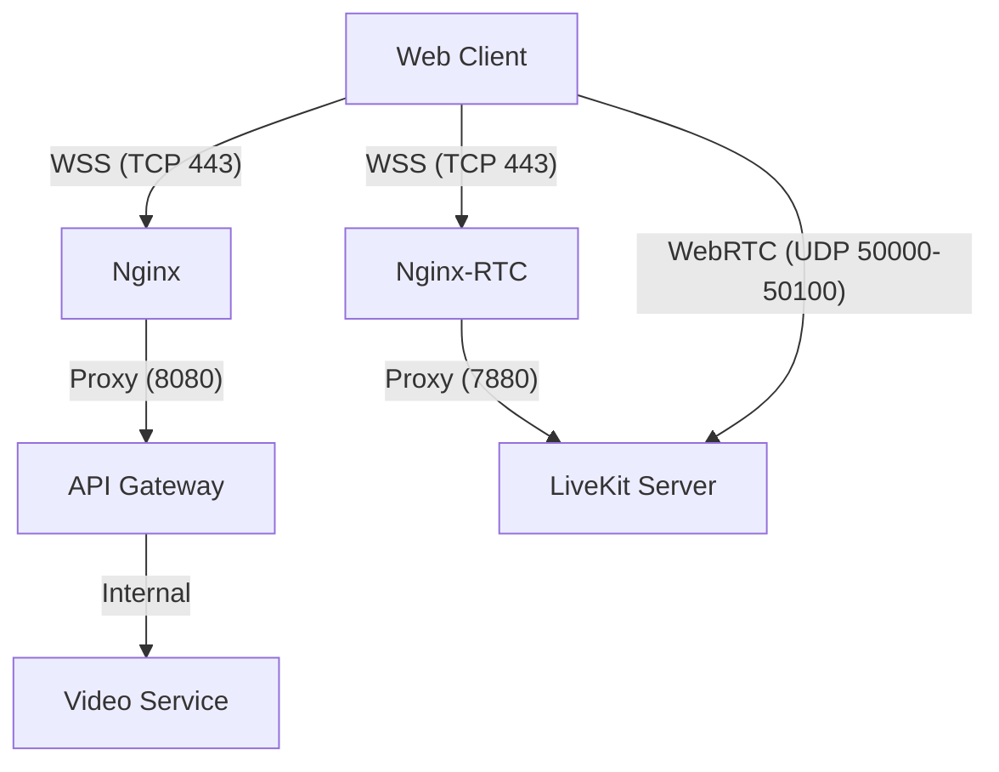

# WebRTC 및 WSS(WebSocket Secure) 이용 가이드

Onmeet 프로젝트에서 실시간 화상 회의 및 채팅 기능을 안정적으로 이용하기 위한 기술 구성과 사용법을 안내합니다.

---

## 1. 아키텍처 개요

Onmeet은 효율적인 실시간 통신을 위해 **신호(Signaling)**와 **미디어(Media)** 전송 경로를 분리하여 운영합니다.

- **신호 및 채팅 (WSS)**: 연결 제어, 방 입장, 채팅 메시지 전송. Nginx와 API Gateway를 거치며 보안(SSL)이 적용됩니다.
- **실시간 미디어 (UDP)**: 영상 및 음성 데이터. 대기 시간을 최소화하기 위해 Nginx를 거치지 않고 LiveKit 서버와 직접 통신합니다.



---

## 2. 접속 정보 (WSS)

모든 실시간 통신은 보안이 적용된 **WSS** 프로토콜을 사용해야 합니다.

| 용도 | 프로토콜 | 도메인 | 에코 엔드포인트 / 경로 |
| :--- | :--- | :--- | :--- |
| **채팅 및 알림** | `wss://` | `api.onmeet.cloud` | `/ws-chat/**` (Stomp 설정 참조) |
| **화상 회의 제어** | `wss://` | `rtc.onmeet.cloud` | `/` (LiveKit SDK 사용 시 자동 지정) |

---

## 3. 클라이언트 구현 가이드

### LiveKit WebRTC 연결 (React/TS 예시)
LiveKit SDK를 사용하여 화상 회의에 연결할 때 아래 URL 형식을 준수하십시오.

```typescript
import { LivekitWebview } from 'livekit-client';

// 신호 통신을 위한 WSS 주소 지정
const LIVEKIT_URL = "wss://rtc.onmeet.cloud";

// 서버(video-service)로부터 발급받은 액세스 토큰
const token = "YOUR_ACCESS_TOKEN";

// 연결 시도
await room.connect(LIVEKIT_URL, token);
```

### 주의 사항
- **Mixed Content**: 웹 사이트가 `https`인 경우, `ws://`는 차단될 수 있으므로 반드시 **`wss://`**를 사용하십시오.
- **포트**: Nginx가 443(HTTPS/WSS) 포트에서 요청을 받아 내부 7880(LiveKit)으로 전달하므로, 클라이언트는 별도의 포트 번호를 붙일 필요가 없습니다.

---

## 4. 인프라 및 보안 설정

### SSL 인증서 관리
각 도메인은 Certbot을 통해 개별 인증서를 사용합니다.
- `api.onmeet.cloud`: Gateway 서비스용
- `rtc.onmeet.cloud`: LiveKit 서비스 전용 (WSS 지원용)

### 방화벽 규칙 (GCP)
미디어 트래픽이 원활하게 흐를 수 있도록 아래 포트가 오픈되어야 합니다.

| 프로토콜 | 포트 범위 | 용도 | 비고 |
| :--- | :--- | :--- | :--- |
| **UDP** | `50000 - 50100` | WebRTC 미디어 스트림 | 필수 (GCP 방화벽 설정 필요) |
| **TCP** | `7881` | WebRTC TCP Fallback | 필요 시 사용 |
| **TCP** | `443` | WSS 및 HTTPS | Nginx를 통해 서빙 |

### 서버 환경변수 (`.env`)
배포 시 아래 변수가 올바르게 설정되어야 합니다.
- `LIVEKIT_EXTERNAL_IP`: GCP VM의 실제 외부 IP 주소 (숫자 형태). ICE Candidate 생성 시 사용됩니다.

---

## 5. 트러블슈팅

### Q1. WSS 연결은 되는데 영상이 나오지 않습니다.
- **원인**: UDP 포트가 닫혀 있거나 `LIVEKIT_EXTERNAL_IP`가 잘못 설정된 경우입니다.
- **해결**: GCP 콘솔에서 UDP 50000-50100 포트가 `0.0.0.0/0`에 대해 열려 있는지 확인하고, `.env`에 올바른 외부 IP가 입력되었는지 검토하십시오.

### Q2. Nginx 기동 시 LiveKit 관련 에러가 발생합니다.
- **원인**: Nginx 시작 시 LiveKit 컨테이너의 DNS 해석이 늦어지는 현상입니다.
- **해결**: 현재 Onmeet의 `nginx.conf`에는 동적 해석(`set $upstream`)이 적용되어 있어, LiveKit이 준비될 때까지 기다렸다가 자동으로 연결을 시도합니다.
